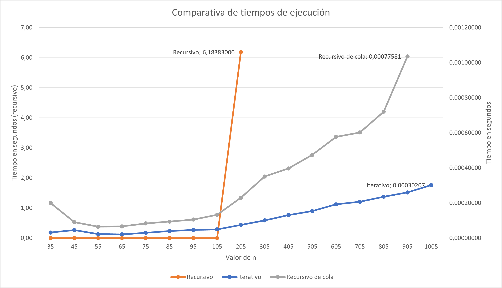
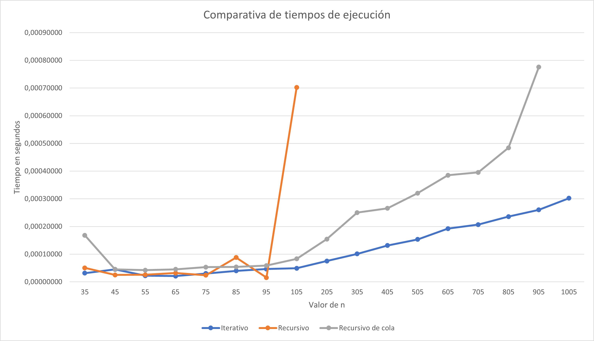

Se presenta en este archivo un análisis de los tiempos de ejecución de las 3 variantes implementadas en la pregunta 4. 

Función:

$$
\mathrm{F_{5,7}}(n) = \begin{cases}
    n & \text{si  } 0 \leq n \lt 35\\
    F_{5,7}(n-7) + F_{5,7}(n-14)+F_{5,7}(n-21)+F_{5,7}(n-28)+F_{5,7}(n-35)& \text{si  } n \gt 35 \\
     \end{cases}
$$

#### Características del equipo

Las pruebas se ejecutaron sobre una máquina virtual de Debian sobre WSL 2 en Windows 10.
- RAM: 3 GB
- CPU: Intel Core i7 x 1 socket x 3 core x 2 threads (6vCPU)

Para las pruebas se usaron valores de `n` desde 35 hasta 1005 con saltos de 10 en 10 hasta llegar al 105 y luego con saltos de 100 en 100 hasta el 1005.

| n  | Recursivo    | Recursivo de cola | Iterativo|
---- | ----         |               ----| ----| 
| 35 |0.00005054 s  |0.00016832 s       |0.00003170 s|
| 45 |0.00002527 s  |0.00004537 s       |0.00004529 s|
| 55 |0.00002598 s  |0.00004243 s       |0.00002241 s|
| 65 |0.00003218 s  |0.00004553 s       |0.00002098 s|
| 75 |0.00002408 s  |0.00005316 s       |0.00003027 s|
| 85 |0.00008821 s  |0.00005412 s       |0.00004005 s|
| 95 |0.00001535 s  |0.00005889 s       |0.00004649 s|
| 105 |0.0007023 s  |0.00008320 s       |0.00004935 s|
| 205 |6.18383 s    |0.00015449 s       |0.00007534 s|
| 305 |-            |0.00025010 s       |0.00010108 s|
| 405 |-            |0.00026559 s       |0.00013136 s|
| 505 |-            |0.00032043 s       |0.00015354 s|
| 605 |-            |0.00038504 s       |0.00019240 s|
| 705 |-            |0.00039553 s       |0.00020670 s|
| 805 |-            |0.00048446 s       |0.00023579 s|
| 905 |-            |0.00077581 s       |0.00026011 s|
| 1005|-            |-                  |0.00030207 s|

Para medir el tiempo se usó la librería `time` de Python, y se ejecutó el código en loops de la siguiente manera:
```Python
for i in range(inicio,fin,salto):
    start_time = time.time()
    print(f"i = {i} F(i) = {funcion(i)}")
    print("timepo: %s segundos" % (time.time()-start_time))
```
Debido al crecimiento exponencial para valores grandes en la función recursiva, se ejecutaron hasta el 205. Para el caso de $n = 1005$ en el recursivo de cola, no se pudo obtener el resultado debido al error: `maximum recursion depth exceeded in comparison`, por el limite de la profundidad en una recursión de Python de 1000.

Podemos observar los resultados en la siguiente gráfica:



El eje Y izquierdo representa al tiempo en segundos para la ejecución recursiva, ya que esta tiene un pico de 6 segundos para $n = 205$, y todos los otros valores están por debajo de 1s, lo cual ocasiona que se distorsione y no se visualices correctamente los otros puntos.

El eje Y derecho representa el tiempo en segundos para la ejecución iterativa y recursiva de cola, las cuales todas tienen tiempos menores de 1s.

Para el caso recursivo de cola, puede considerarse que tiene un crecimiento exponencial pero con un crecimiento menor que el recursivo. El método iterativo tiene un crecimiento lineal.

Descartaremos el valor $n = 205$ para el caso recursivo ya que es un dato atípico para todo el conjunto de datos que se tiene, a fin de observar mejor todos los otros valores.



En este caso, se observa que el crecimiento del caso recursivo es exponencial, además se estima que para la ejecución de $n =300$ puede demorar más de 20 minutos en terminar. Aquí se demuestra que esta implementación es poco eficiente para valores mayores a 200. Esto es motivado a cómo funciona la recursión. Veamos un ejemplo:

Para $n = 43$ se tiene:

$
F(43) = \\
 = F(43-7)+ F(43-14) + F(43-21) + F(43-28) + F(43-35) \\
 = F(36)+F(29)+F(22)+F(15)+F(8) \\
 = F(36-7)+ F(36-14) + F(36-21)+ F(36-28) + F(36-35)+F(29)+F(22)+F(15)+F(8)\\
 = F(29)+F(22)+F(15)+F(8) + F(29)+F(22)+F(15)+F(8)
 = 29+22+15+8+29+22+15+8
 = 148
$

Es evidente que es necesario realizar las expansiones y evaluaciones recursivas para cada función y es al final de la llamada de cada función cuando se llega al caso base $0 <= n <35$ que se puede sumar. Esto hace que las funciones recursivas sean más ineficientes en este caso, ya que debe realizar una enorme cantidad de expansiones, las cuales deben ser guardadas en memoria y ocasiona un gran tiempo para el cálculo.

La función recusiva de cola es muchísimo más eficiente, ya que por como está construida el cálculo se va haciendo a medida que se hacen las llamadas y no requiere tanto uso de memoria ni cálculo de procesamiento.

Finalmente, la ejecución iterativa es más eficiente que la recursiva de cola, con un crecimiento más lento y un menor consumo de memoria.

No siempre las ejecuciones iterativas son más eficienes que las recursivas, en este caso lo es debido a la gran cantidad de cálculos y memoria requerida para procesar un número $n$.

Ahora bien, para valores de n menores a 100, todas las funciones resolvieron los cálculos rápidamente. Más aún considerando que para $n < 35$ el tiempo es $O(1)$.
